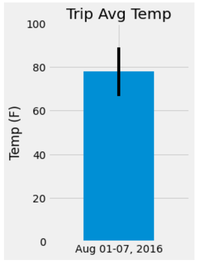

# UCF Data Analysis And Visualization Bootcamp - SQLAlchemy Homework - Surfs Up!

### Intro

This purpose of this homework was to complete some climate analysis on the area of Hawaii.  Precipitation and temperature data was analyzed to plan for a coming vacation. Data was collected at a series of weather stations across the region and the measurements saved to a file.  The list of weather stations was also saved to a file with information about each station's location. 

## Step 1 - Climate Analysis and Exploration

To begin, we used Python and SQLAlchemy to do basic climate analysis and data exploration of the climate database. All of the analysis was completed using SQLAlchemy ORM queries, Pandas, and Matplotlib.

Using the provided starter notebook and `hawaii.sqlite` files, we completed analysis of the weather data, following these general steps:

* Using SQLAlchemy `create_engine` to connect to your sqlite database.

* Using SQLAlchemy ORM's `automap_base()` to reflect your tables into classes and save a reference to those classes called `Station` and `Measurement`.

* Linking Python to the database by creating an SQLAlchemy session.

* Querying the tables using SQLAlchemy's query() method and creating Panda's DataFrames with the results.

* Plotting and analyzing data from the dataframes. 

### Precipitation Analysis

For this analysis, we queried the last 12 month of the available measurement data, selecting the date and precipitation (prcp) values.  We assembled the columns into a pandas DataFrame, using the date column as the index.  We then plotted the year of measurements for precipitation in a Pandas bar chart.  Using Panda's `describe()` method, we also printed some statistics for the precipitation data.  

  

### Station Analysis

For station analysis we : 

  * Designed a query to calculate the total number of stations in the dataset.

  * Designed a query to find the most active stations.  

  * Listed the stations and observation counts in descending order.

  * Found the station id has the highest number of observations.

  * Using the most active station id, calculated the lowest, highest, and average temperature.  For this task, we used a functions `func.min`, `func.max`, `func.avg`, and `func.count` in our queries.

  * Designed a query to retrieve the last 12 months of temperature observation data (TOBS).

  * Filtered by the station with the highest number of observations, and queried the last 12 months of temperature observation data for this station

  * Plotted the results as a histogram with `bins=12`:

    
	
	The final notebook can be accessed from the [Github repo.](https://github.com/j0serobles/sqlalchemy-challenge/blob/main/climate_starter.ipynb)

- - -

## Step 2 - Climate App

We developed a simple API using [Flask](https://palletsprojects.com/p/flask/) to return data from our datasets in JSON format.

### Routes

To access the JSON data, run `python app.py` from your command line and browse to any of these routes.

  

* `/`

  * Home page.

  * List all routes that are available.
  
  

* `/api/v1.0/precipitation`

  * Convert the query results to a dictionary using `date` as the key and `prcp` as the value.

  * Returns the JSON representation of your dictionary.
  
  

* `/api/v1.0/stations`

  * Returns a JSON list of stations from the dataset.
  
  

* `/api/v1.0/tobs`

  * Query the dates and temperature observations of the most active station for the last year of data, and returns a JSON list of temperature observations (TOBS) for the previous year.
  
  
  

* `/api/v1.0/<start>` and `/api/v1.0/<start>/<end>`

  * Returns a JSON list of the minimum temperature, the average temperature, and the max temperature for a given start or start-end range.

  * When given the start only, calculates `TMIN`, `TAVG`, and `TMAX` for all dates greater than and equal to the start date.

  * When given the start and the end date, calculates the `TMIN`, `TAVG`, and `TMAX` for dates between the start and end date inclusive.
  
    

- - -

## Bonus: Other Recommended Analyses

### Temperature Analysis I

Since Hawaii is reputed to enjoy mild weather all year, the purpose of this analysis is to find if there is a meaningful difference between the temperature in, for example, June and December.

We used pandas to perform this analysis.   First, we converted the date column format from string to datetime, and set the date column as the index of a DataFrame.  Then for each year, we computed the average temperature in June and December across all years in the data set. We performed a paired t-test to determine whether the difference in the means, if any, is statistically significant.

The notebook with the analysis results can be accessed at the [Github repo.](https://github.com/j0serobles/sqlalchemy-challenge/blob/main/temp_analysis_bonus_1_starter.ipynb)

 

### Temperature Analysis II

For this bonus, we want to find out what the probable temperatures are going to be during a future vacation in Hawaii, by finding out the minimum, average and maximum temperatures during the sames dates a year ago.

We used a supplied function called `calc_temps` that will accept a start date and end date in the format `%Y-%m-%d`. The function returns the minimum, average, and maximum temperatures for that range of dates; we plotted the temperature values using a bar plot with a y-error bar.

 

The notebook with the analysis results can be accessed at the [Github repo.](https://github.com/j0serobles/sqlalchemy-challenge/blob/main/temp_analysis_bonus_2_starter.ipynb)

### Daily Rainfall Average

In this analysis, we want to determine what the precipitation and daily normals could be during the trip to Hawaii, based on these values for previous dates. 
First, we determined the rainfall for each weather station using the previous year's matching dates.  Then, we computed the daily normals using the supplied function `daily_normals` that calculates the daily normals for a specific date.

The results were then loaded into a Pandas DataFrame and plotted using an area plot:

The notebook with the analysis results can be accessed at the [Github repo.](https://github.com/j0serobles/sqlalchemy-challenge/blob/main/temp_analysis_bonus_2_starter.ipynb)

